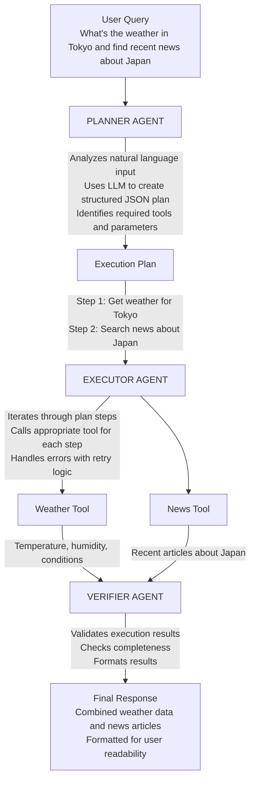

# AI Operations Assistant

Multi-agent AI system that processes natural language tasks using Planner to Executor to Verifier architecture with real API integrations.

## Submitted by:
- Name: **Nayan Mandal**
- Email: bt22csd035@iiitn.ac.in | nayan.iiitn@gmail.com
- Phone Number: +91-93696-67968

## Setup Instructions

**Prerequisites**: Python 3.9+

1. **Navigate to project directory**:
   ```bash
   cd GenAI-Intern-Assignment---TrulyMadly
   ```

2. **Install dependencies**:
   ```bash
   pip install -r requirements.txt
   ```

3. **Configure environment variables**:
   
   Copy `.env.example` to `.env` and add your API keys:
   ```bash
   copy .env.example .env    # Windows
   cp .env.example .env      # macOS/Linux
   ```

4. **Get API keys** (add to `.env`):
   - Groq: [console.groq.com/keys](https://console.groq.com/keys)
   - OpenWeatherMap: [openweathermap.org/api](https://openweathermap.org/api)
   - NewsAPI: [newsapi.org/register](https://newsapi.org/register)
   - GitHub (optional): [github.com/settings/tokens](https://github.com/settings/tokens)

5. **Run the project**:
   ```bash
   uvicorn main:app
   ```

Access the API at: http://localhost:8000/docs

## Environment Variables Required

See `.env.example` for the complete template. Required variables:

```env
LLM_PROVIDER=groq
GROQ_API_KEY=your_groq_api_key_here
OPENWEATHER_API_KEY=your_openweathermap_api_key_here
NEWS_API_KEY=your_newsapi_key_here
GITHUB_TOKEN=your_github_token_here  # Optional
```

## Architecture



**Multi-agent system with three specialized agents:**

1. **Planner Agent** (`agents/planner.py`)
   - Converts natural language input into structured JSON execution plan
   - Uses LLM to identify required tools and parameters
   - Validates plan against available tools

2. **Executor Agent** (`agents/executor.py`)
   - Executes plan steps sequentially
   - Calls appropriate API tools for each step
   - Implements retry logic (up to 3 attempts) on failures

3. **Verifier Agent** (`agents/verifier.py`)
   - Validates execution results for completeness
   - Formats output into user-friendly response
   - Uses LLM to ensure quality and consistency

**Tools:**
- `tools/github_tool.py` - GitHub API integration
- `tools/weather_tool.py` - OpenWeatherMap API integration
- `tools/news_tool.py` - NewsAPI integration

**LLM Client** (`llm/client.py`): Unified interface supporting OpenAI and Groq with JSON-mode outputs

## Integrated APIs

1. **GitHub API**
   - Search repositories, get repository details, list user repos
   - Returns: stars, forks, description, language, topics

2. **OpenWeatherMap API**
   - Get current weather by city name or coordinates
   - Returns: temperature (C/F), humidity, conditions, wind speed

3. **NewsAPI**
   - Search news articles, get top headlines by country/category
   - Returns: title, source, description, URL, publish date

## Example Prompts

1. `"Find the top 5 Python machine learning repositories on GitHub"`
2. `"What's the weather in Tokyo and find recent news about Japan"`
3. `"Search for repositories related to FastAPI and get the current weather in San Francisco"`
4. `"Get the latest technology news"`
5. `"Tell me about the tensorflow repository"`

**Test with curl:**

```bash
# Example 1: GitHub repositories
curl -X POST "http://localhost:8000/query" \
  -H "Content-Type: application/json" \
  -d '{"query": "Find the top 5 Python machine learning repositories on GitHub"}'

# Example 2: Weather and news
curl -X POST "http://localhost:8000/query" \
  -H "Content-Type: application/json" \
  -d '{"query": "What is the weather in Tokyo and find recent news about Japan"}'

# Example 3: Multi-tool query
curl -X POST "http://localhost:8000/query" \
  -H "Content-Type: application/json" \
  -d '{"query": "Get the latest technology news"}'
```

## Known Limitations

- **Sequential execution**: Steps execute one at a time (not parallel)
- **No caching**: Each request makes fresh API calls
- **API rate limits**: GitHub (60/hour without token), OpenWeatherMap (1000/day), NewsAPI (100/day)
- **NewsAPI restriction**: Free tier works on localhost only, cannot search articles older than 1 month
- **No conversation history**: Each request is stateless
